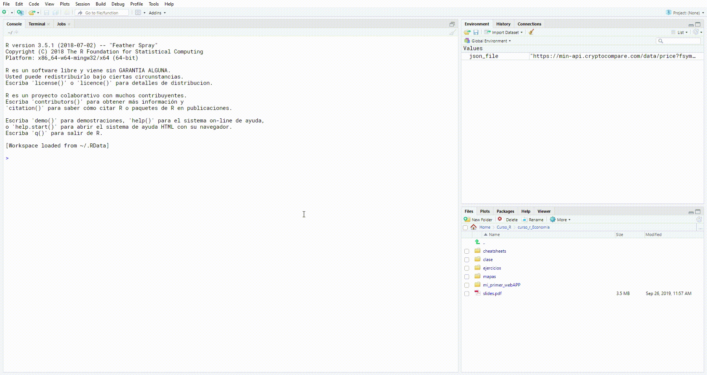

En este breve tutorial explicaremos paso a paso como instalar R y Rstudio 😄

Básicamente instalar R es instalar el lenguaje en nuestras computadoras y por
otra parte instalar Rstudio es algo conocido como un IDE(Integrated Development Environment)
que en resumen es la manera que Interactuamos con el lenguaje R. 😉

Digamos que R(el lenguaje) es el motor y Rstudio son el volante, los pedales y palanca de velocidades
🏎️🏎️🏎️🏎️🏎️

## Lo primero que haremos sera instalar R-core desde *https://cran.itam.mx/*

daremos click aquí **Download R for Windows**

.png)

Ahora en **install R for the first time.**

.png)

Ahora en **Download R 4.0.3 for Windows**
(*la version actual es la 4.0.3 en noviembre del 2020*)

.png)

Ahora esperaremos unos minutos hasta que se descargue esto dependerá de la
velocidad de tu internet.

Pasados estos minutos instalaremos como cualquier otro programa dando doble
click sobre el archivo descargado

**Es muy probable que después de dar doble click, te aparezca una ventana con la leyenda _Quieres permitir que esta aplicación realice cambios en tu dispositivo?_ solo da click en el botón _Sí_**

Después se desplegara la siguiente ventana
damos click en **Siguiente >**

.png)

Nuevamente click en **Siguiente >**

.png)

Nuevamente click en **Siguiente >**

.png)

Una vez más click en **Siguiente >**

.png)

Marcamos las casillas indicadas y click en **Siguiente >**

.png)

Y **listo!** Ya tenemos instalado R 🥳

## Ahora toca el turno de Rstudio 😁

Lo primero que haremos sera ir al siguiente enlace

https://rstudio.com/products/rstudio/download/#download

Y descargaremos la versión de Rstudio para windows

.png)

Esperamos unos minutos a que descargue

Y doble click sobre el archivo descargado

**Es muy probable que después de dar doble click, te aparezca una ventana con la leyenda _Quieres permitir que esta aplicación realice cambios en tu dispositivo?_ solo da click en el botón _Sí_**

Se desplegara la siguiente ventana y daremos
click en **Siguiente >**

.png)

Nuevamente click en **Siguiente >**

.png)

Una vez más click en **Siguiente >**

.png)

Ya tenemos instalado Rstudio en nuestro equipo!! 🥳 🥳

Para comprobar que todo esta correcto instalaremos nuestro primer paquete

escribiendo lo siguiente en la *consola* y despues la tecla Enter

`install.packages("tidyverse")`

Despues de *_varios_* segundo ya estará instalado el paquete *_tidyverse_*

*FELICIDADES!* ya tienes todo lo necesario para comenzar en este mundo de *R* 🤗
